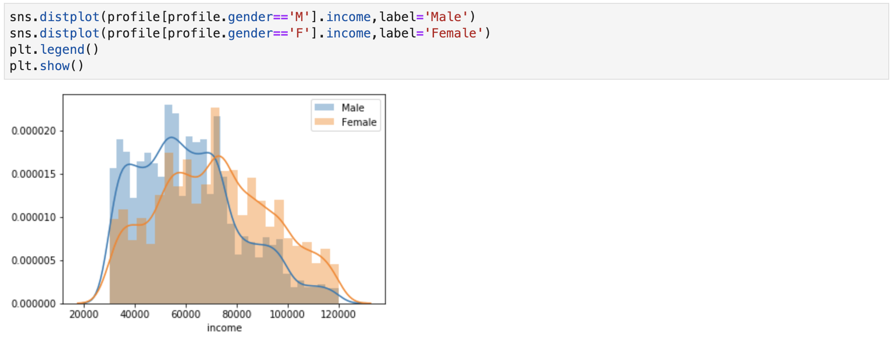
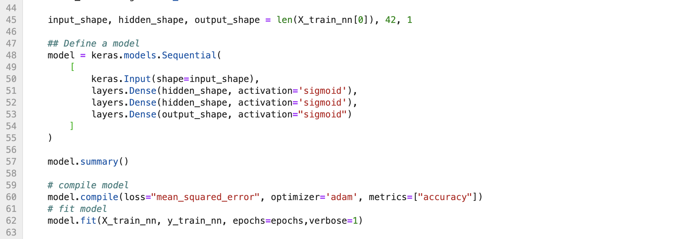

# Machine Learning Engineer Nanodegree

## Capstone Project
September 2021

This Capstone project is part of the Udacity Machine Learning Engineer Nanodegree. First, the problem to solve is defined and potential solutions and performance metrics investigatd. Next, the problem will be analyzed through visualizations and an initial data exploration to gain a better understanding of what algorithms and features are appropriate for solving it. Further, two algorithms are implemented to tackle the problem. Results will be collected and validated accordingly. Finally, the results will be discussed in regard to possible improvements.

## I. Definition

Chapter I will give an overview over the project as well as define the problem statement asked for in this project and the metrics to evaluate.

### Project Overview

Starbucks is one of the most well-known companies of the world and the world's largest coffeehouse chain. Its goal is to give his customers always the best service and the best experience. In doing so, Starbucks offers a free app to make orders online, predict the waiting time, to operate a customer rewards program, and to promote special offers. These promotions include drink advertisements, discount offers, and buy one get one free (BOGO) offers. To maximize the effectiveness of these promotional offers, not every customer receives the same promotional offer. Instead, Starbucks tailors promotions and advertisements to the unique characteristics of individual customers and their customer segments. 

This capstone project aims to predict customer responses to tailor marketing and promotional offers, also known as propensity modeling. Udacity partnered with Starbucks to provide a real-world data set for this use case. Yet, the given data are not real-life data but rather simulated data mimicking their customer behavior. This ensures data privacy. The data allow for propensity modeling to attempt to predict the likelihood of users of the starbucks mobile web app to react to specific offers. Overall, we want to propose marketing offers on a personalized selection of users.

### Problem Statement
The aim is to predict what user will accept and offer and what user does not. Some customers do not want to receive offers and might be turned off by them, so we want to avoid sending offers to those customers. User are distinguished using personal data like gender, age, and income, etc.

### Metrics

The analysis will include looking on the accuracy of the models predictions. The ***accuracy*** defines the proportion of both True Positives and True Negatives among the total number of cases. The best value is one, the worst value is zero.

Additionally, there are two possible errors in prediction which need to be looked in to, False Positives and False Negatives.

A False Positive prediction will most likely result in the user ignoring the marketing effort. This results in wasted effort of the company as well as the user feeling bothered by it. ***Precision*** is used for high False Positives. The best value is one, and the worst value is zero.

A False Negative predictions means there is no offer sent but user would have likely used it, resulting in an wasted business opportunity. ***Recall*** is used for high False Negatives. The best value is one, and the worst value is zero.

Following those thoughts the evaluation will focus on the recall and precision as well to reduce the number of False Negatives. Recall seems to be more important for our business case.

## II. Analysis

The structure of the project consists of three separate notebooks. The naming convention states their functionality.

* 1-Data_Exploration.ipynb
* 2-Feature_Engineering.ipynb 
* 3-Model-training.ipynb

The data sets for data exploration and for model training will be stored on an AWS S3 bucket and loaded accordingly. All scripts will be executed using AWS Sagemaker.

### Data Exploration

The data consists of 3 .json-files containing simulated data that mimic customer behavior on the Starbucks rewards mobile app.

**portfolio.json - contains information about the offers**

Overall, there are three types of offers that can be sent: buy-one-get-one (BOGO), discount, and informational. In a BOGO offer, a user needs to spend a certain amount to get a reward equal to that threshold amount. In a discount, a user gains a reward equal to a fraction of the amount spent. In an informational offer, there is no reward, but neither is there a requisite amount that the user is expected to spend. Offers can be delivered via multiple channels: email, web, mobile, social. Each offer can be identified via an id.

**profile.json - contains information about the customers**

The profile data incorporates demographical data such as age, income, gender, and when the user became a member. Each person can be identified via an id.

**transcipt.json - contains information about customer purchases and interaction with the offers**

The transcipt data consists of the persons interactions to offers or purchases, denoted as event. There are four types: offer received, offer viewed, offer completed, and transactions. The offer can be identified via an offer_id, and the person can be identified via an person_id.

### Exploratory Visualization

Most revelant for our analysis and as input into the models are the demographical data. It is important to account for a normal (or equal) distribution of feature values. The following two graphs depict the gender-age relation as well as the gender-income relation.

Overall, there are three genders. Male, female, and other. The following analysis will focus on the prior two, as other has fairly few data entries.

Males and females are normal distributed over age. The minimum age is 20, the maximum age is 118.

Females tend to be normal distributed over income. Males seem to have a lower income in general compared to females. The income ranges from 30000 to 120000.

Further, as the goal is to predict whether an offer is successful or not, it is important to look at the distribution of the four offer types: offer received, offer viewed, offer completed, and transactions. About 40% of the data entries are transactions. Out of all offer entries, 33575 have been completed. It is important to note that customers can complete an offer without viewing it.

### Algorithms and Techniques

A Support Vector Machine (SVM) will be used as a **benchmark model**, using the kernel method to utilize non-linearity. The SVM will be implemented using scikit-learn and deployed using sagemaker. Secondly, an Artificial Neural Netwrk (ANN) will be implemented and compared with the benchmark model. The ANN will be implemented using tensorflow and also deployed using sagemaker. The data will be split into a training and testing sets using a 80-20 split.

I am aware that a more simpler more interpretable benchmark model would be to use a logistic regression. However, out of curiousity I have chosen to use an SVM.

## III. Methodology

### Data Preprocessing

Data preprocessing includes feature engineering and data cleaning of the three given data tables.

The portfolio data is one-hot-encoded on the offer types and the channels where these offers are promoted. Additionally, difficulty and duration are normalized.

Similar to the portfolio table, the profile data is one-hot-encoded on the genders and age. In order to one-hot-encode age, age groups have been defined in intervals of 10 years. Additionally, the membership of the customers have been calculated to the number of total days (from registration until today).

The transcript data is one-hot-encoded on the event types and value column. Most important from the values are the offer_id and id_offer, as they are used to merge the data in the next step.

All three of the above mentioned and feature-engineered dataframes will be combined to one dataframe including all features. After merging the data tables, the corresponding ids can be dropped as well as other columns that are not needed. Further, duplicated and rows inlucing NaN-values will be dropped as well. This leaves a total of 59046 entries for modeling and 28 features.

As the goal is to predict the completed offers, it is important to have a final check on their relation compared to all offers. After feature engineering and data cleaning, this leaves us with a total 10308 completed offers, which is about 17.5% of all offers in the data.

The combined dataframe will be split into training and testing set using a 80-20 ratio. This results in 47236 entries for the training, and 11810 entries for the test set.

### Implementation

The implementation of both models can be seen in the following images. 

The hyperparameters for the SVM & ANN, as well as the structure of the ANN have been defined in an iterative process. Below shown are the final.

*SVM*

*ANN*

### Refinement

Refinement of the models has been done iteratively during development and while debugging. For example, the structure of the ANN has been adjusted to a different number of layers and nodes, as well as varying activation functions, optimizers, or loss functions.

## IV. Results

### Model Evaluation and Validation

*SVM*

The SVM had a "perfect" prediction of 100%. This means, that Recall and Precision are both at 1.0. The SVM can predict whether a customer will complete its offer.

*ANN*

The ANN seems only to predict zeros, meaning to predict a non completed offer. The accuracy of 83% depicts the ratio of non-completed offers of the fully combined dataset. Thus, the current ANN is not able to predict whether a customer will complete its offer. 

### Justification

The overall goal was to predict whether an user complete accept or not. The problem can be solved using the benchmark SVM model. The ANN needs further refinement as it is not able to predict in its current state. Yet, it is a best practice to go with a simpler model in production, meaning I would state the analysis and modeling apprach as successful.

## V. Conclusion
 

### Improvement

Clearly, the ANN need improvements such as it is not able to predict the current task. 

Further, the feature engineering and data cleaning can be improved. For example, there are multiple entries per person with different event. There might be a correlation over time which could be accounted for. It could also be analyzed what type of channel is relevant for an offer completion.

### Reflections

The most difficult part was to get the tensorflow model running on sagemaker, as there were some specifics about the model saving and estimator.predictions. 

However, I really enjoyed working on this use case and also on debugging, as I learned a lot about sagemaker and using it to deploy models.